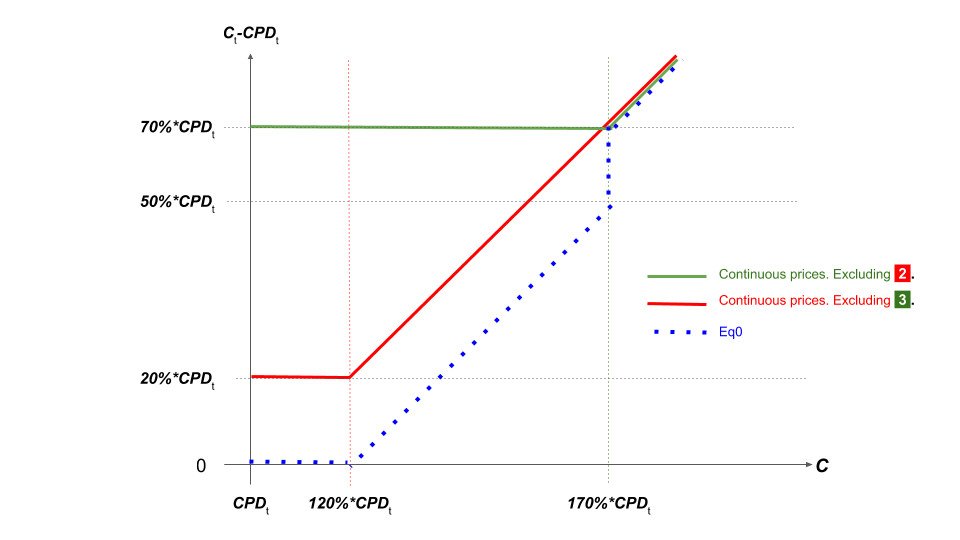

# Quantitative Introduction to the Equilibrium \(Smart\) Contract

Equilibrium lets an EOS holder generate EOSDT stablecoins \(USD pegged\), if EOS tokens that are worth at least 170% of the EOSDT value are posted as collateral.

As explained in our [previous articles](https://blog.eosdt.com/equilibrium-infrastructure-roles-and-voting-mechanisms/), EOS and the [EOSIO](https://eos.io/) infrastructure use the democratic DPoS protocol. One of the protocol’s features lets EOS holders vote to elect 21 Block Producers \(BPs\). However, the EOS must be [staked](https://www.eoscanada.com/en/what-does-staking-and-unstaking-eos-tokens-mean) to grant their holder the right to vote, and can only be unstaked after three days.

Although votes have key financial and strategic considerations, **freezing a portion of the Equilibrium collateral for three consecutive days increases Equilibrium’s insolvency risk**. In a previous [article](https://medium.com/equilibrium-eosdt/the-threshold-for-staked-eos-collateral-a-robust-framework-4dce569173cb), we presented a first model that estimates the probability of an extreme loss on the collateral value over three days. The model can be used to determine a reasonably safe staking ratio. But this model has strong limitations.

For instance, although we mentioned that the collateral ratio \(CR\) would have a natural support level that is significantly higher than the 170% critical CR, the model disregarded this behavior and considered the collateral on a standalone basis.

### Rational Position Owners 

As rational agents, the Equilibrium participants have an objective to generate the best return for a given level of risk. In particular, by posting EOS as collateral and issuing EOSDT, Position Owners keep their exposure on EOS, and create liquidity they can use to invest in different opportunities: they can even leverage their EOS position further.

Among other return and risk considerations:

* **The liquidity** **created has a cost.** This cost is paid through ****Equilibrium’s admin and equilibrium fees. These fees are accrued, and paid on EOSDT redemption.
* **The risk inherent to the total EOS Positions is “exchanged” for a low-risk EOSDT total position.** The Position Owner has the option \(no obligation\) to redeem his EOSDT. If the collateral value crashes below the value of the issued EOSDT, he can walk away.
* **The risk** **of forced liquidation comes with a 20% liquidation fee.** Risk averse Position Owners would post more collateral, above the 170% minimum required, to avoid forced liquidation.

**Equilibrium is governed by several variables that are designed for the Position Owners, as a group, to create liquidity in the safest possible manner.**  

### The Position Owners Group: Asset & Liability Management \(ALM\)  

**The Position Owners group is comparable to a company** where the EOS pooled collateral constitutes their main asset, and the total EOSDT generated constitutes their main liability. EOSDT is valued at US dollar parity \($1 US dollar = 1 EOSDT\) as long as the company is going concern.

The EOSDT collateral management is similar to an ALM problem waiting to be solved!

In particular, cash flow and balance sheet solvencies are better protected by having enough liquid assets at hand. In a severe EOS market downturn, the company should protect its solvency by selling \(liquidating\) assets, and use the sale proceeds to buy back its liabilities. Similarly, Equilibrium would sell the EOS held in the under-collateralized accounts, to buy back and burn the relevant EOSDT. In other words, Equilibrium would **deleverage its balance sheet**.  

### The Equilibrium \(Smart\) Contract:A Down-and-Out Perpetual American Call Option 

The balance sheet analogy is an application of [Merton](http://www.people.hbs.edu/rmerton/Pricing%20of%20corporate%20debt.pdf)’s structural credit risk model.

In a few words, a company’s liabilities are usually less volatile than its assets. Hence, the model assumes that the company’s liabilities are the strike of a call option on the company’s assets. The cash-settled call option with a strike _**L**_, and underlying _**A**_ has the following cash flows:

1. At inception \(**t**=0\): the option buyer pays a premium **p** to buy the call option
2. At maturity \(**t**=**T**\):
   1. if **A**&gt;**L** \(assets above liabilities\), the buyer can exercise the option to receive **A**-**L**
   2. otherwise the option expires **worthless**

Obviously, the flows in Equilibrium are more complex than a simple call option. To analyze the Equilibrium framework and understand all the mechanics involved, we should strip away the complexity and consider intermediate steps.

**In this article, let’s start with a version of the Equilibrium contract that has no margin call.** In this version the Position Owner cannot post more collateral. If the collateral ratio drops below the critical level, the Position Owner will still incur the liquidation fee.

Let’s go over the option’s specifics:

**1/** there is no concept of fixed maturity \(yet\) in Equilibrium. in financial terms: _**the option is**_ _**perpetual**_.

**2/** The Position Owner can decide to redeem his position at any time. In financial terms: _**the option is american.**_

**3/** A position is closed if it is either:  

* redeemed by the Position Owner. In financial terms: _**the option is exercised**_. 
* or automatically terminated as soon as the collateralization ratio drops below the critical level. In financial terms: _**the option is knocked-out**_. 

**4/** Insolvency corresponds to the collateral value falling below the generated EOSDT value accrued at the relevant rates \(e.g. the equilibrium fee\). In Equilibrium, this accrued EOSDT is called _the current position debt_ ****\(_**CPD**_t\). It is time-varying. In financial terms: _**the option has a time-varying strike**_**.**

**5/** Instant termination \(the knock-out\) corresponds to the collateral value falling at or below 170% of the current position debt. It is also time-varying. In financial terms: _**the option has a time-varying barrier level**_**.**

**6/** The option has an initial cost. In financial terms, it is _**the option’s premium**_

Below is a description of the contract’s premium and payout profile for the Position Owner:

1. At inception \(**t**=0\): the Position Owner posts collateral valued at $$ C_0$$ and generate a value $$ CPD_0$$ of EOSDT. The premium paid is $$ p = C_0 - CPD_0\ge70 \% * CPD_0 $$
2. At termination date \(**t**=**𝛕**\), there is either:
   1. **exercise**: if the collateral value increases, the Position Owners can redeem their EOSDT and make a profit. The payout is **C𝛕 - CPD𝛕**
   2. **worthless termination**: if the collateral value reduced by the liquidation fee \(**C**/120%\) drops below the level of the current position debt **CPD𝛕**, the Position Owners should walk away with the EOSDT generated \(or the equivalent dollars they bought against it\). The payout is **nil**.
   3. **safe termination**: if the collateral value drops below 170% of the сurrent position debt, but the collateral reduced by the liquidation fee is still above the current position debt, then the Position Owner can still recover **C𝛕**/\(1+20%\) against repayment of the current position debt. The payout is **C𝛕**/\(1+20%\) - **CPD𝛕**

### The Equilibrium \(Smart\) Contract: A Version In Continuous Time \(Cheaters Edition\) 

Price continuity is a theoretical concept. Oraclize \(now Provable\) provides real-time information about the collateral market so Equilibrium knows when a liquidation should be triggered. But there is still discreteness and probably latency in the quotes provided.

Oraclize is like a referee in a soccer game. The referee will glance at the football goal every now and then. He would only know how far from the goal line the ball is if he looks in the right direction. Maybe he didn’t notice that the ball had already crossed the goal line. Worse \(or better, depending on your team\), maybe the ball did cross the goal line but was pushed back by the goalkeeper, and the referee missed it all! Let’s call this game the _distracted referee_ _game_. In this context, the continuous time model is like video footage in football. The question is not whether it’s better or worse. It’s just \(slightly?\) different.

The best part is: if we assume prices are continuous, the payout profile is much simpler!  

Indeed, the _worthless termination_  **** event cannot happen, and the intermediate _safe termination_  **** event is terminal ! In fact, the termination date 𝛕 is the first time when the _safe termination_  **** event **almost** occurs. In other words, 𝛕 is the first time when the collateral ratio **almost** reaches 170% of the current position debt: the Position Owner must \(**and can!** as there is no price gap\) redeem his position to avoid the liquidation fee, and his option payout is 170%\*_**CPD**_𝛕 - _**CPD**_𝛕. In this scenario, the referee can see the ball almost crossing the goal line: he can blow the whistle just before and end the game! OK, in this example, the game looks frustratingly unfair: the referee is the Position Owner and the Position Owner is obviously a cheater: can he just stop the game whenever a catastrophic outcome is looming?! Honestly?! Let’s call this game the _unfair referee game._

How do we bring fairness to this game? It turns out the game can still be fair if the Position Owner pays a substantial \(Equilibrium\) fee to play.

In this article, the balance between the Equilibrium fee and the contract’s value is indeed our main concern. The liquidation fee and critical collateral level merely define floor levels for the Position Owner payout: there is absolutely no interest for the Position Owner to let the collateral value move below these floors.

First Remark: in practice, as we’ve already hinted, the expiration date \(_**t**_=𝛕\) is within a discrete set of observations \(e.g. every time prices are fetched from Provable - every five minutes or better\).

Following a serious collateral price drop between two observations, the event  **** could happen with a small but non-nil probability.

Second Remark: Although in practice, the strike of the american option is also monitored in a discrete manner, the Position Owner can still walk away with his EOSDT such that his maximum loss is limited to the premium _**p**_. The discreet monitoring of the strike is a risk for Equilibrium.  

Third Remark: The _unfair referee game_ can also be considered in the alternative case of the referee who blows the whistle **just after** the ball crosses the goal line. In which case the referee is Equilibrium, penalizing the Position Owner instantly, and protecting the balance sheet from further loss in the collateral value: we would assume that the collateral is sold instantly without frictions.

In a frictionless world of continuous prices, events **2**  and **3**  can't coexist. Graph\[1\] represents various payout profiles:

* In **red** if we exclude event **3** , the contract is a perpetual american call option struck at **CPD**t with a down & out barrier at 120% CPDt and a down & in one-touch option \(protection\) paying 20%\***CPD**t.
* In **green** if we exclude event **2** , the contract looks like a perpetual american call option struck at **CPD**t. with a down & out barrier at 170% **CPD**t and a down and in one-touch option \(protection\) paying 70%\***CPD**t.
* In **blue** is the payout profile. It is a closer version of the Equilibrium contract. Let’s call it Eq-0. It is all the potential final payouts of the contract in discrete time. Eq-0 terminates as soon as the collateral ratio drops below 170%.

As we can see from Graph \[1\], **in a frictionless and continuous prices world,** **both the red and green contracts, hold no risk below respectively the 170% and 120% levels**.  

Despite what the graph might suggest, the red and green payout profiles are not necessarily valid upper bounds for Eq-0. The red and green payout profiles live in a continuous time world, whereas Eq-0 lives in discrete time. Between two monitoring dates, in a _distracted referee game_, the collateral value can consecutively drop below the 170% barrier **and** recover straight away. In this scenario the Eq-0 contract might still be alive, but the green contract would have been terminated.

[Xia and Zhou](http://www.math.nus.edu.sg/~matdm/ma5245/semi/1.pdf) propose an analytic closed-form solution to price a perpetual american call in the _stock loan case_. The collateral model \(a Geometric Brownian Motion\) doesn’t capture the [levels of risk seen for the EOS collateral](https://blog.eosdt.com/equilibrium-infrastructure-collateral-adjustment-mechanisms/), but it is the first step towards a more effective model. To formalize the model, let’s define:

* _**Ɣ**_ as the equilibrium fee
* \(λ-1\) as the protection: in our continuous model framework, it represents either an excess collateral \(70%: green curve\) or _****_a liquidation fee \(20%: red curve\). In both cases, both _unfair game\(s\)_, the Position Owner would exercise right before the dropping collateral ratio touches respectively the 170% or the 120% levels. In that sense, both games have a protection against further losses.
* 𝛕q the first time when the collateral value almost touches the λ\*CPD0 level

We are looking for the optimal stopping time 𝛕 before 𝛕q that maximizes the contract’s expected value:  
  
$$ sup_τE((C_τ−CPD_0∗e^{γτ})1_{τ < τ_q} +(λ−1)∗CPD_0∗e^{γτ}1{τ=τ_q}) $$

For the red payout profile:     λ = 120%

For the green payout profile: λ = 170%

**Each of these simplified payout profiles can give us insight on the Equilibrium structure mechanisms.**

### For Equilibrium: A First Estimate Of The Minimum Required Collateral Ratio 

For simplicity and to explain the framework’s mechanics, let’s focus first on the no penalty, and no critical ratio case \(λ = 100%\).

The λ &gt; 100% case seems to be a good candidate for an [Ekstrom](http://www2.math.uu.se/~henrik/artiklar/HW4.pdf)-like model that we analyze briefly at a later stage.

In the GBM world, Xia and Zhou would tell us that **an Equilibrium structure with an Equilibrium fee** _**Ɣ**_**, a generated EOSDT value at CPD0 and a collateral value C0, can be offered to Position Owners if the following two constraints are satisfied**:

* **the Equilibrium fee** _**Ɣ**_ **should be higher than half the squared volatility** _**σ2**_ **of the collateral.**
* **the excess collateral should be high enough such that:**

$$ \frac{C_0−CPD_0}{C0}⩾\frac{σ^2}{2γ}$$

In the Equilibrium case, at inception, we have

$$ \frac{C_0−CPD_0}{C_0}=\frac{70\%∗CPD_0}{170\%∗CPD_0}≈41\%$$

Hence, the constraint becomes

$$ γ⩾121\%∗σ^2$$

The second constraint is more restrictive. Using only EOS as collateral, the Equilibrium fee that would satisfy the second constraint can quickly reach very high levels. For this reason alone, this simple structure and model are not adapted for Equilibrium.

**For a volatility around 20%, and an Equilibrium fee around 3%, the required collateral ratio would be above 320%!**

The 3D ****plot \[2\] below shows how high the required ratio or the Equilibrium fee can get. In the Equilibrium context of a required collateral ratio above 170%:

* For a volatility level around 20%, an Equilibrium fee above 4.5% would be warranted.
* For a volatility level around 25%, an Equilibrium fee above 7% would be warranted.

As mentioned before, the cost for the Position Owner in an _unfair referee game_ should be much higher than in an alternative _distracted referee game._ This is where the full Equilibrium structure \(the _fair game_\) starts to make sense:

* The liquidation fee will bring balance and decrease the cost for the Position Owner.
* The discrete monitoring will compromise the protection and should also decrease the cost for the Position Owner.

Despite its imperfections, Xia and Zhou’s model gives the reader the rationale for the presence in Equilibrium of the **liquidation fee** and **discrete time monitoring with margin calls**.

### For The Position Owner: A First Estimate Of The Maximum Collateral Ratio  

In the λ &gt; 100% case, [**an adaptation of the Ekstrom version of the Xia and Zhou model**](https://www.overleaf.com/6423158944spvkqxysccmh) **gives the minimum \(optimal\) exercise level for a given critical collateralization level \(ƛ\)**.

The optimal exercise level should be at or above the highest root of a polynomial in

$$ \frac{1}{λ}y+\frac{2γ}{σ^2−2γ}−\frac{σ^2}{σ^2−2γ}y^{1−\frac{2γ}{σ^2}}=0$$

**At λ=170%, the model provides the Position Owner with a cap level for the collateral to be held in the account.** Above this cap level**, the Position Owner should optimally:**

* **retrieve a portion of his collateral**. The retrieved EOS can be staked or sold to diversify his risk.
* **or generate more EOSDT \(more liquidity\)** that he can also use to diversify his risk.

The model quantifies either the collateral to retrieve, or the additional EOSDT to generate.

The models presented show inflated values for the Equilibrium fee as the cost a Position Owner should pay to play an _unfair referee game_ is high. In future articles, we’ll need to integrate all the missing features of Equilibrium \(discreteness, margin calls\) to generate more reasonable estimates.

Furthermore, the Black-Scholes model used here might not be adapted to model the EOS dynamics. Further analysis of intraday data \(e.g. 5min to match the expected collateral monitoring frequency\) would help us determine the model’s suitability.

_With this article and many to come, we are taking serious steps to educate the Equilibrium community, to instill confidence in the framework’s mechanisms, and to ultimately benefit the community itself._

1. MERTON, ON THE PRICING OF CORPORATE DEBT: THE RISK STRUCTURE OF INTEREST RATES. The Journal of Finance. Vol 29, No. 2. December 1973
2. XIA, ZHOU, STOCK LOANS. Mathematical Finance, Vol. 17, No. 2, pp. 307-317, April 2007.
3. EKSTROM, WANNTROP, MARGIN CALL STOCK LOANS. 2008

